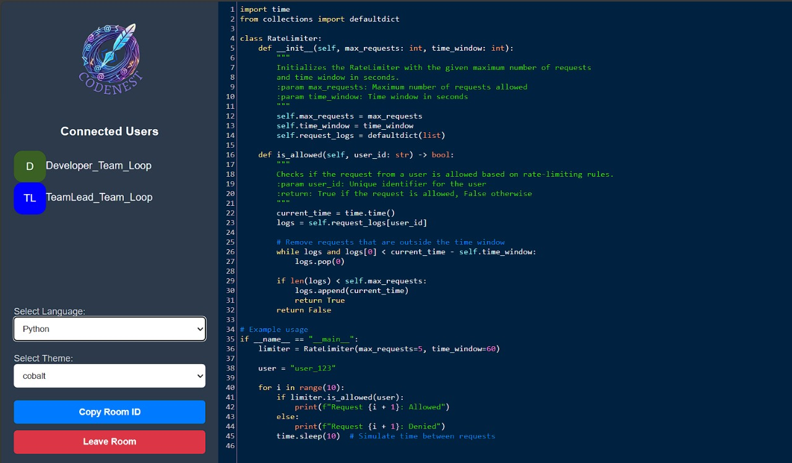

# **Codenest - Realtime Collaborative Code Editor**

<p align="center">
  
</p>


Codenest is a realtime collaborative code editor designed to enhance team productivity. It allows multiple developers to write, edit, and discuss code together in real-time with seamless synchronization. Built with WebSockets for real-time communication, Codenest aims to bridge the gap in team collaboration.
 
## 🚀 **Features**

- **Real-time collaboration:** Edit and view changes instantly across users.
- **Code highlighting:** Supports syntax highlighting for various programming languages.
- **Room-based sessions:** Create and join coding rooms for team discussions.
- **Cross-platform compatibility:** Works on web browsers for seamless accessibility.
- **Version tracking:** Tracks changes in real-time to avoid conflicts.
- **User-friendly interface:** Clean and intuitive design for effortless collaboration.

## 🛠️ **Technologies Used**

- **Frontend:** HTML5, CSS3, JavaScript, [Ace Editor](https://ace.c9.io/), WebSocket.
- **Backend:** Python (Flask-SocketIO).
- **Real-time Communication:** Flask-SocketIO and WebSockets.
- **Styling:** Custom CSS with Flexbox and modern UI components.
- **Hosting:** Compatible with cloud platforms like Heroku, AWS, and Render.

## 📦 **Getting Started**

### Prerequisites
1. Install Python 3.8 or higher.
2. Install pip, the Python package manager.

### Installation

1. Clone the repository:
   ```bash
   git clone https://github.com/ABISHEK-RAJ-AP/CodeNest-Collaborative-Editor.git
   cd CodeNest-Collaborative-Editor
   ```

2. Install dependencies:
   ```bash
   pip install -r requirements.txt
   ```

3. Run the application:
   ```bash
   python app.py
   ```

4. Open the application in your browser:
   ```
   http://127.0.0.1:5000
   ```
   
## 🖥️ **Usage**

1. Open the application in your browser.
2. Create a new room or join an existing one.
3. Start coding and watch changes update in real-time for all participants.
4. Collaborate with your team using the built-in syntax highlighting and versioning.

## 🤝 **Contributing**

We welcome contributions from the community! To contribute:

1. Fork the repository.
2. Create a new branch:
   ```bash
   git checkout -b feature/your-feature-name
   ```
3. Commit your changes:
   ```bash
   git commit -m "Add your feature"
   ```
4. Push to your branch:
   ```bash
   git push origin feature/your-feature-name
   ```
5. Submit a pull request.

## 🛡️ **License**

This project is licensed under the MIT License. See the [LICENSE](LICENSE) file for details.

## 🌟 **Support**

If you find this project helpful, please ⭐ the repository and share it with your friends and colleagues!

## 📧 **Contact**

For any questions or suggestions, feel free to contact me:

- **Email:** [apabishekraj@gmail.com](mailto:apabishekraj@gmail.com)
- **GitHub:** [ABISHEK-RAJ-AP](https://github.com/ABISHEK-RAJ-AP)

---

Enjoy coding with **Codenest**! 🐦✨
